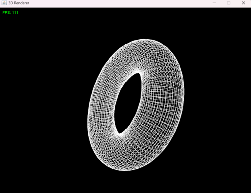

# 🖥️ Simple 3D Renderer

A simple **3D Renderer in Java** built from scratch using **weak perspective projection** and **rotation matrices**.

---

## 📐 Mathematical Foundations

### **1️⃣ Weak Perspective Projection**
The renderer uses **weak perspective projection**, which simplifies full **3D perspective projection**.
The **projection formula** is:

$$
x' = \frac{f \cdot x}{z_{\text{avg}}}, \quad y' = \frac{f \cdot y}{z_{\text{avg}}}
$$

---

### **2️⃣ Rotation Matrices**
To rotate 3D objects, we use **rotation matrices** around each axis:

#### **Rotation around the X-axis**
$$
R_x(\theta) =
\begin{bmatrix}
1 & 0 & 0 \\
0 & \cos\theta & -\sin\theta \\
0 & \sin\theta & \cos\theta
\end{bmatrix}
$$

We can use:

$$
x' = x
$$
$$
y' = y \cos\theta - z \sin\theta
$$
$$
z' = y \sin\theta + z \cos\theta
$$

#### **Rotation around the Y-axis**
$$
R_y(\theta) =
\begin{bmatrix}
\cos\theta & 0 & \sin\theta \\
0 & 1 & 0 \\
-\sin\theta & 0 & \cos\theta
\end{bmatrix}
$$

We can use:

$$
x' = x \cos\theta + z \sin\theta
$$
$$
y' = y
$$
$$
z' = -x \sin\theta + z \cos\theta
$$

#### **Rotation around the Z-axis**
$$
R_z(\theta) =
\begin{bmatrix}
\cos\theta & -\sin\theta & 0 \\
\sin\theta & \cos\theta & 0 \\
0 & 0 & 1
\end{bmatrix}
$$

We can use:

$$
x' = x \cos\theta - y \sin\theta
$$
$$
y' = x \sin\theta + y \cos\theta
$$
$$
z' = z
$$

---

## 🎮 Controls
**Use `WASD` or `Arrow Keys` to control the rotation.**